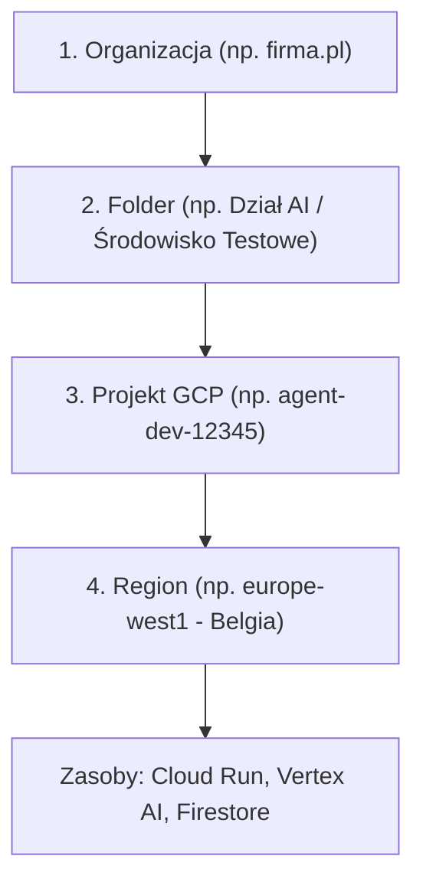
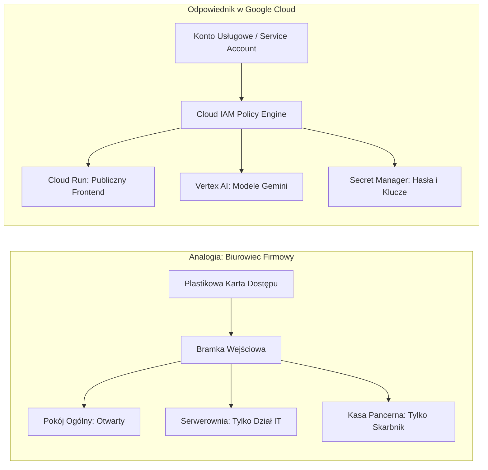

# Przewodnik Startowy: Jak myśleć o Google Cloud (Dla Początkujących)

Jeśli dopiero zaczynasz swoją przygodę z Google Cloud Platform (GCP) i sztuczną inteligencją opartą na agentach, wiele pojęć chmurowych może wydawać się przytłaczających. Ten rozdział to Twój **słowniczek i mapa mentalna**, która pozwoli Ci pewnie poruszać się po kolejnych modułach.

---

## Czym właściwie jest Google Cloud Platform (GCP)?

GCP to zestaw setek gotowych usług obliczeniowych, bazodanowych, sieciowych i modeli AI działających w centrach danych Google na całym świecie. 

Zamiast kupować własny serwer fizyczny, instalować na nim Linuksa i konfigurować zasilanie awaryjne, wynajmujesz zasoby w modelu **na żądanie (Pay-As-You-Go)** – płacąc tylko za sekundy lub megabajty, które Twoja aplikacja faktycznie zużyje.

---

## 4 Kluczowe Pojęcia Organizacyjne w GCP

Każdy inżynier pracujący z GCP musi znać te cztery poziomy:



### 1. Projekt GCP (`Project ID`)
To podstawowa jednostka rozliczeniowa i granica bezpieczeństwa w GCP. Wszystko, co tworzysz (baza danych, kontener, model AI), musi należeć do konkretnego projektu.
* `Project ID` to unikalny identyfikator na całym świecie (np. `my-company-agents-prod-8842`).

### 2. Regiony i Strefy (Regions & Zones)
Google posiada centra danych w różnych częściach świata.
* **Region** to obszar geograficzny (np. `europe-west1` – Belgia, `europe-central2` – Warszawa).
* **Zasada dla juniora:** Zawsze uruchamiaj usługi agenta i bazy danych w **tym samym regionie** (np. `europe-west1`), aby uniknąć opóźnień sieciowych (latency) oraz kosztów transferu danych między regionami.

### 3. Włączanie Usług (API Enablement)
W nowo utworzonym projekcie GCP większość usług jest domyślnie **wyłączona**. Zanim uruchomisz Cloud Run lub zapytasz model Gemini, musisz jednorazowo włączyć odpowiednie API:
```bash
gcloud services enable \
  run.googleapis.com \
  aiplatform.googleapis.com \
  secretmanager.googleapis.com \
  firestore.googleapis.com
```

### 4. Narzędzie `gcloud CLI` i Uwierzytelnianie Lokalne
`gcloud` to oficjalne narzędzie wiersza poleceń do zarządzania GCP.

Rozróżniamy dwa rodzaje logowania na Twoim komputerze:

| Typ Logowania | Komenda | Do czego służy? |
| :--- | :--- | :--- |
| **Logowanie Użytkownika (CLI)** | `gcloud auth login` | Pozwala Tobie uruchamiać komendy `gcloud` w terminalu (np. tworzyć zasoby, sprawdzać logi). |
| **Application Default Credentials (ADC)** | `gcloud auth application-default login` | Tworzy lokalny token, z którego korzystają biblioteki w kodzie (np. `import vertexai` w Twoim skrypcie Pythona). |

---

## Mentalny Model Bezpieczeństwa: Analogia do Biurowca

Aby zrozumieć IAM, Service Accounts i RBAC, wyobraź sobie nowoczesny biurowiec korporacyjny:



1. **Pracownik (Człowiek):** Loguje się do biura dowodem osobistym i hasłem.
2. **Robot Sprzątający / Serwisant (Service Account):** Nie ma twarzy ani dowodu – posiada zakodowaną kartę zbliżeniową przypisaną do swojej roli.
3. **Uprawnienia na karcie (IAM Roles):** Karta serwisanta otwiera schowek na szczotki (`roles/storage.objectViewer`), ale nie otworzy kasy pancernej prezesa (`roles/secretmanager.admin`).
4. **Bramka z czytnikiem (Cloud Run IAM Invoker):** Zanim robot wejdzie do pokoju innego agenta, bramka sprawdza, czy jego karta ma aktualny wpis.

---

## 5 Złotych Zasad dla Junior Developera w GCP

1. **Nigdy nie używaj roli `Owner` ani `Editor` dla aplikacji:** Zawsze szukaj roli predefiniowanej (np. `roles/aiplatform.user`).
2. **Nigdy nie pobieraj kluczy prywatnych `.json` na swój komputer:** Używaj `gcloud auth application-default login --impersonate-service-account`.
3. **Pamiętaj o zmiennej środowiskowej `$PORT` w Cloud Run:** Twój serwer w kontenerze **musi** nasłuchiwać na porcie podanym w zmiennej `$PORT` (domyślnie `8080`) i na adresie `0.0.0.0` (a nie `127.0.0.1`).
4. **Zawsze konfiguruj limity czasu (Timeouts):** Wywołania modeli LLM trwają dłużej niż standardowe zapytania REST (ustaw timeout na minimum 30-60 sekund).
5. **Śledź koszty:** Wykorzystaj mechanizm *Scale-to-Zero* w Cloud Run oraz darmowe pakiety (Free Tier) w GCP.

---

Teraz, gdy znasz fundamenty, przejdź do [Modułu 1: Protokół A2A (Agent-to-Agent)](01-a2a-protocol.md), aby zobaczyć, jak agenci współpracują ze sobą.
