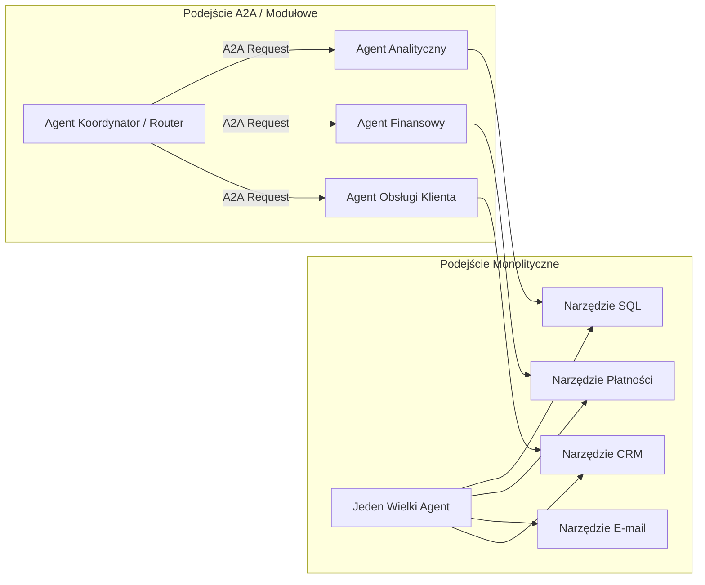

# Moduł 1: Protokół A2A (Agent-to-Agent)

W architekturze sztucznej inteligencji opartej na wielu agentach (**Multi-Agent Systems**), pojedynczy model językowy nie wykonuje wszystkich zadań samodzielnie. Zamiast budować jeden monolityczny prompt o gigantycznym kontekście, system dzieli się na wyspecjalizowane agenty o ściśle zdefiniowanych odpowiedzialnościach.

Protokół **A2A (Agent-to-Agent)** to ustandaryzowany zestaw reguł, struktur danych i schematów komunikacyjnych umożliwiający autonomicznym agentom wymianę wiadomości, delegowanie podzadań i współdzielenie kontekstu.

---

## Dlaczego potrzebujemy systemów Multi-Agent?

W miarę wzrostu złożoności aplikacji pojedynczy agent napotyka bariery:
* **Zanieczyszczenie kontekstu (Context Dilution):** Przekazanie modelowi dziesiątek narzędzi jednocześnie obniża precyzję wyboru właściwego narzędzia (*tool hallucination*).
* **Brak izolacji uprawnień:** Jeśli jeden agent ma dostęp do bazy danych, płatności i wysyłki e-maili, każda luka w prompcie (*prompt injection*) może doprowadzić do nieautoryzowanych operacji.
* **Trudności w testowaniu i utrzymaniu:** Mały, wyspecjalizowany agent jest deterministyczny, łatwiejszy do przetestowania jednostkowego i niezależnego wdrażania.



---

## Topologie komunikacji agentowej

W zależności od wymagań biznesowych systemy A2A stosują trzy podstawowe wzorce:

### 1. Wzorzec Orchestrator-Worker (Hierarchiczny)
Agent nadrzędny (Orchestrator) przyjmuje cel od użytkownika, planuje kroki, rozbija zadanie na mniejsze części i deleguje je do agentów wykonawczych (Workers). Agenci wykonawczy zwracają wyniki do koordynatora, który scala odpowiedź.

### 2. Wzorzec Router / Dispatcher
Router analizuje intencję użytkownika i przekazuje całe zapytanie bezpośrednio do jednego, najbardziej odpowiedniego agenta dziedzinowego.

### 3. Wzorzec Peer-to-Peer (Współpraca partnerska)
Agenci komunikują się bezpośrednio między sobą w oparciu o wspólny kanał wiadomości (np. Pub/Sub lub kolejki zadań), przekazując stan sesji krok po kroku.

---

## Anatomia komunikatu A2A

Komunikacja A2A opiera się na ustrukturyzowanym formacie JSON. Każdy komunikat zawiera metadane śledzenia sesji, tożsamość nadawcy i odbiorcy, typ intencji oraz ładunek danych (*payload*).

### Standardowy schemat wiadomości A2A:

```json
{
  "protocol_version": "1.0",
  "message_id": "msg_987a-654b-321c",
  "conversation_id": "conv_a1b2-c3d4-e5f6",
  "parent_message_id": "msg_123x-456y-789z",
  "timestamp": "2026-08-31T21:55:00Z",
  "sender": {
    "agent_id": "orchestrator-main",
    "role": "planner",
    "service_account": "orch-sa@my-gcp-project.iam.gserviceaccount.com"
  },
  "recipient": {
    "agent_id": "database-analytics-agent",
    "endpoint": "https://analytics-agent-xyz-uc.a.run.app/a2a/v1/task"
  },
  "message_type": "task_delegation",
  "action": "execute_query_analysis",
  "parameters": {
    "query_prompt": "Podsumuj sprzedaż w regionie EU za Q3 2026",
    "max_records": 100,
    "response_format": "json"
  },
  "context": {
    "user_id": "usr_42",
    "auth_level": "analyst",
    "correlation_id": "corr_888-999"
  }
}
```

### Kluczowe pola protokołu:
* `conversation_id`: Identyfikator nadrzędnej sesji. Pozwala wszystkim agentom biorącym udział w przetwarzaniu zachować spójny ślad audytowy.
* `message_type`: Określa intencję komunikatu:
  * `task_delegation` – zlecenie wykonania konkretnego zadania,
  * `status_update` – informacja o postępie długotrwałego zadania,
  * `task_result` – pomyślny wynik z danymi wyjściowymi,
  * `error` – błąd wykonania z kodem i opisem.
* `context`: Bezpiecznie przekazywane informacje o tożsamości użytkownika końcowego i poziomie uprawnień.

---

## Agent Cards & Discovery (Karty i Odkrywanie Agentów)

Aby orkiestrator wiedział, jakie usługi są dostępne w sieci agentowej, każdy agent publikuje tzw. **Agent Card** (metadane agenta) pod ustandaryzowanym endpointem `/.well-known/agent.json`.

```json
{
  "agent_id": "financial-risk-agent",
  "name": "Financial Risk Assessment Agent",
  "description": "Analizuje ryzyko kredytowe i scoring klientów B2B na podstawie danych finansowych.",
  "version": "1.2.0",
  "endpoints": {
    "task": "/a2a/v1/task",
    "health": "/healthz"
  },
  "capabilities": [
    {
      "action": "calculate_risk_score",
      "description": "Oblicza wskaźnik scoringowy w skali 0-100 dla podanego NIP/KRS.",
      "parameters_schema": {
        "type": "object",
        "properties": {
          "company_tax_id": { "type": "string" },
          "financial_year": { "type": "integer" }
        },
        "required": ["company_tax_id"]
      }
    }
  ],
  "sla": {
    "timeout_seconds": 30,
    "max_concurrent_requests": 50
  }
}
```

---

## Implementacja w Pythonie (FastAPI)

Poniżej znajduje się prosty przykład dwóch współpracujących agentów: **Agenta Koordynatora** oraz **Agenta Specjalistycznego (Data Specialist)**.

### 1. Agent Specjalistyczny (`data_agent.py`)

```python
from fastapi import FastAPI, HTTPException
from pydantic import BaseModel, Field
from typing import Dict, Any, Optional
import datetime

app = FastAPI(title="Data Analytics Specialist Agent")

class A2AMessage(BaseModel):
    protocol_version: str = "1.0"
    message_id: str
    conversation_id: str
    action: str
    parameters: Dict[str, Any]
    context: Optional[Dict[str, Any]] = None

class A2AResponse(BaseModel):
    message_id: str
    conversation_id: str
    status: str
    result: Dict[str, Any]
    timestamp: str

@app.get("/.well-known/agent.json")
def get_agent_card():
    return {
        "agent_id": "data-specialist",
        "description": "Agent do obliczeń i agregacji danych",
        "actions": ["aggregate_sales"]
    }

@app.post("/a2a/v1/task", response_model=A2AResponse)
async def handle_a2a_task(msg: A2AMessage):
    if msg.action == "aggregate_sales":
        region = msg.parameters.get("region", "GLOBAL")
        # Przykładowa logika biznesowa agenta
        total_revenue = 450000.00 if region == "EU" else 890000.00
        return A2AResponse(
            message_id=f"res_{msg.message_id}",
            conversation_id=msg.conversation_id,
            status="SUCCESS",
            result={"region": region, "total_revenue_eur": total_revenue, "records_count": 1420},
            timestamp=datetime.datetime.now(datetime.timezone.utc).isoformat()
        )
    raise HTTPException(status_code=400, detail=f"Nieobsługiwana akcja: {msg.action}")
```

### 2. Wywołanie z Agenta Koordynatora (`orchestrator.py`)

```python
import httpx
import uuid
import asyncio

async def call_specialist_agent(sub_agent_url: str, action: str, params: dict):
    payload = {
        "protocol_version": "1.0",
        "message_id": f"msg_{uuid.uuid4()}",
        "conversation_id": f"conv_{uuid.uuid4()}",
        "action": action,
        "parameters": params,
        "context": {"source": "orchestrator-main"}
    }
    
    async with httpx.AsyncClient(timeout=15.0) as client:
        response = await client.post(f"{sub_agent_url}/a2a/v1/task", json=payload)
        response.raise_for_status()
        return response.json()

if __name__ == "__main__":
    url = "http://localhost:8000"
    data = asyncio.run(call_specialist_agent(url, "aggregate_sales", {"region": "EU"}))
    print("Odpowiedź od Agenta Specjalistycznego:", data)
```

---

## Podsumowanie i Dobre Praktyki

1. **Stosuj unikalne `conversation_id`:** Przekazuj ten sam identyfikator przez cały łańcuch wywołań agentów, aby umożliwić centralne logowanie i audyt.
2. **Definiuj kontrakty JSON:** Każdy agent powinien ściśle walidować dane wejściowe (np. za pomocą biblioteki Pydantic).
3. **Obsługuj timeouty:** Żądania A2A do agentów LLM mogą trwać od kilku sekund do minuty. Zawsze konfiguruj limity czasu na poziomie klienta HTTP.

W kolejnym kroku dowiesz się, jak agent przekazuje dane do użytkownika w postaci dynamicznych komponentów. Przejdź do [Modułu 2: Interfejs A2UI (Agent-to-User)](02-a2ui-protocol.md).
