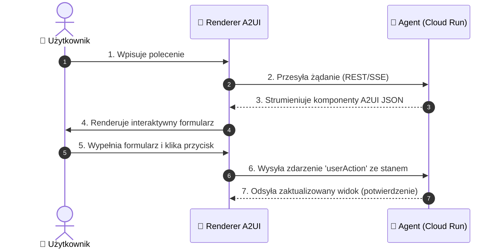

# Moduł 2: Interfejs A2UI (Agent-to-User Interface)

Gdy autonomiczny agent wchodzi w interakcję z człowiekiem, standardowy tekst lub surowy format Markdown szybko okazują się niewystarczające. Użytkownik potrzebuje interaktywnych formularzy, tabel danych, przycisków akcji, kalendarzy czy wykresów, a agent musi natychmiast otrzymać informację zwrotną o wprowadzonych zmianach.

**A2UI (Agent-to-User Interface)** to lekki, bezpieczny i zorientowany na strumieniowanie protokół deklaratywnego interfejsu użytkownika, zaprojektowany specjalnie dla modeli językowych i agentów AI.

---

## Dlaczego Markdown i surowy HTML to za mało?

W tradycyjnych aplikacjach czatowych z LLM pojawiają się trzy główne ograniczenia:
1. **Brak interaktywności i dwukierunkowego stanu:** Markdown pozwala jedynie wyświetlać statyczny tekst i tabele. Nie można w nim zaimplementować formularza z walidacją po stronie klienta.
2. **Ryzyko bezpieczeństwa surowego kodu HTML/JS:** Generowanie surowego kodu JavaScript przez model niesie ryzyko podatności XSS (*Cross-Site Scripting*) i trudności w kontrolowaniu stylów.
3. **Opóźnienia strumieniowania:** Czekanie na wygenerowanie kompletnego kodu strony blokuje interfejs użytkownika.

A2UI rozwiązuje te problemy, przesyłając **deklaratywne struktury JSON**, które renderer klienta (np. w Lit, React, Angular czy Flutterze) natychmiast przekształca w natywne komponenty UI.

---

## Architektura i Przepływ Danych w A2UI

Protokół A2UI opiera się na ciągłej pętli synchronizacji stanu:



---

## Główne filary protokołu A2UI

### 1. Spłaszczona lista komponentów (Component Adjacency List)
Zamiast głęboko zagnieżdżonego drzewa JSON (które jest trudne do strumieniowania i parsowania przez LLM w czasie rzeczywistym), A2UI stosuje **płaską tablicę komponentów**. Każdy komponent posiada unikalne `id` oraz odwołuje się do swoich dzieci za pomocą identyfikatorów.

### 2. Dwukierunkowe wiązanie danych (Two-Way Data Binding)
Stan formularza nie jest zakodowany na stałe w komponentach. Komponenty wskazują na ścieżki w modelu danych za pomocą standardu **JSON Pointer** (np. `/booking/date` lub `/customer/email`). 
Gdy użytkownik wpisuje tekst w pole, model danych w kliencie aktualizuje się automatycznie.

### 3. Katalogi komponentów (Component Catalogs)
Renderer posiada zdefiniowany katalog znanych komponentów (np. `Text`, `Button`, `TextField`, `Card`, `Table`, `Select`). Agent nie przesyła kodu implementacji komponentu, a jedynie nazwę z katalogu i parametry. Zapobiega to wstrzykiwaniu złośliwego kodu do przeglądarki.

### 4. Zdarzenia i akcje (`userAction`)
Gdy użytkownik kliknie przycisk, renderer nie przeładowuje strony, lecz generuje komunikat akcji (`userAction`) i przesyła go do agenta wraz ze zsynchronizowanym stanem danych.

---

## Przykładowy ładunek A2UI (JSON)

Poniżej znajduje się przykładowy komunikat generowany przez Agenta, tworzący prosty formularz kontaktowy:

```json
{
  "protocol_version": "0.9.1",
  "data_model": {
    "contact": {
      "name": "Jan Kowalski",
      "email": "",
      "topic": "Wsparcie techniczne"
    }
  },
  "components": [
    {
      "id": "root_card",
      "type": "Card",
      "properties": {
        "title": "Formularz zgłoszeniowy"
      },
      "children": ["input_name", "input_email", "btn_submit"]
    },
    {
      "id": "input_name",
      "type": "TextField",
      "properties": {
        "label": "Imię i nazwisko",
        "value": { "$ref": "/contact/name" }
      }
    },
    {
      "id": "input_email",
      "type": "TextField",
      "properties": {
        "label": "Adres e-mail",
        "placeholder": "jan@firma.pl",
        "value": { "$ref": "/contact/email" }
      }
    },
    {
      "id": "btn_submit",
      "type": "Button",
      "properties": {
        "label": "Wyślij zgłoszenie",
        "variant": "primary"
      },
      "actions": {
        "on_click": {
          "action_type": "userAction",
          "action_name": "submit_contact_form",
          "payload": {
            "form_state": { "$ref": "/contact" }
          }
        }
      }
    }
  ]
}
```

### Co dzieje się po kliknięciu przycisku?
Po kliknięciu przycisku `Wyślij zgłoszenie`, renderer A2UI po stronie przeglądarki generuje zapytanie do Agenta:

```json
{
  "event_type": "userAction",
  "action_name": "submit_contact_form",
  "timestamp": "2026-08-31T22:00:00Z",
  "data": {
    "form_state": {
      "name": "Jan Kowalski",
      "email": "jan.kowalski@example.com",
      "topic": "Wsparcie techniczne"
    }
  }
}
```

---

## Porównanie podejść do generowania UI przez Agentów

| Cecha | Surowy HTML / JS | Standardowy Markdown | Protokół A2UI |
| :--- | :--- | :--- | :--- |
| **Bezpieczeństwo (XSS)** | Niskie (ryzyko wstrzyknięcia skryptu) | Wysokie | Wysokie (bezpieczny renderer katalogowy) |
| **Interaktywność (Formularze)** | Wymaga kodu JS po stronie agenta | Brak (tylko statyczny odczyt) | Pełna (dwukierunkowy data-binding) |
| **Strumieniowanie** | Trudne parsowanie częściowego HTML | Płynne dla tekstu | Płynne strumieniowanie obiektów JSON |
| **Spójność wizualna (Design System)** | Trudna do wymuszenia na modelu | Bardzo ograniczona | Automatyczna (katalog komponentów klienta) |

---

## Podsumowanie

A2UI pozwala rozdzielić **logikę podejmowania decyzji przez agenta** od **warstwy wizualnej klienta**:
* Agent decyduje *co* pokazać i *jakie dane* powiązać.
* Klient (aplikacja webowa lub mobilna) decyduje *jak* to wyrenderować zgodnie z design systemem firmy.

W kolejnym module dowiesz się, jak zasilać agentów modelami korporacyjnymi. Przejdź do [Modułu 3: Gemini Enterprise & Vertex AI](03-gemini-enterprise.md).
