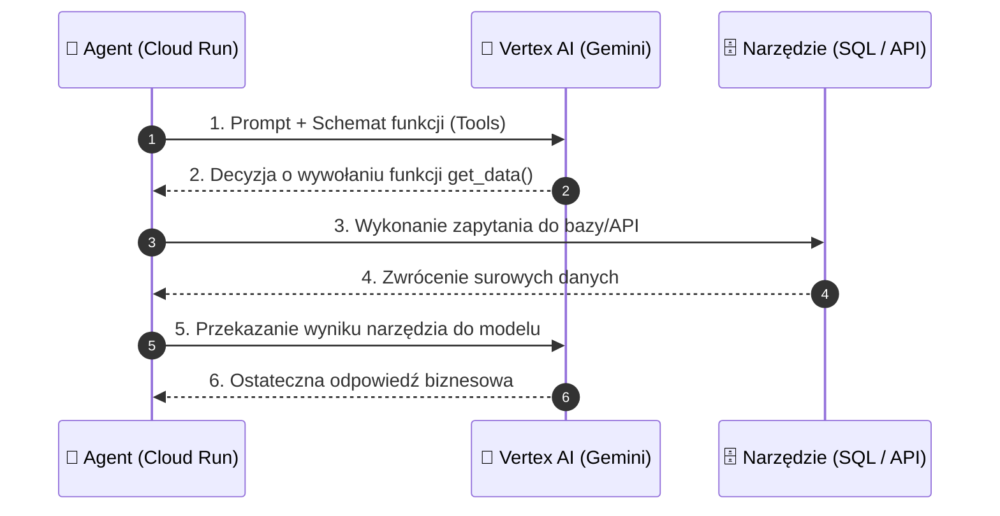

# Moduł 3: Gemini Enterprise & Vertex AI

Podstawą inteligencji autonomicznego agenta jest model językowy (LLM). W zastosowaniach produkcyjnych i korporacyjnych bezpośrednie korzystanie z konsumenckich API niesie ze sobą ryzyko związane z prywatnością danych, limitami przepustowości oraz brakiem gwarancji SLA.

W chmurze Google Cloud Platform modelem dedykowanym do zastosowań biznesowych jest **Gemini w ramach platformy Vertex AI (Gemini Enterprise)**.

---

## Google AI Studio vs. Vertex AI Gemini Enterprise

Dla początkującego inżyniera kluczowe jest zrozumienie różnicy między środowiskiem deweloperskim a korporacyjnym:

| Cecha | Google AI Studio (Konsumenckie API) | Vertex AI Gemini (Enterprise) |
| :--- | :--- | :--- |
| **Prywatność danych** | Dane mogą podlegać analizie (chyba że wybrano płatny tier) | **Brak wykorzystywania promptów do trenowania modeli bazowych** |
| **Rezydentność danych** | Brak gwarancji lokalizacji przetwarzania | Wybór regionu (np. `europe-west1` - Belgia, `europe-west4` - Holandia, `europe-central2` - Warszawa) |
| **Zarządzanie kluczami (KMS)** | Brak obsługi CMEK | Pełna obsługa kluczy zarządzanych przez klienta (CMEK) |
| **Autoryzacja** | Statyczny klucz API (`GEMINI_API_KEY`) | **Google Cloud IAM & Service Accounts (OIDC / OAuth2)** |
| **Gwarancje SLA** | Brak gwarancji SLA | Oficjalne SLA Google Cloud (99.9%+) |
| **Przepustowość (Throughput)** | Dzielone pule zapytań (RPM/TPM) | Możliwość rezerwacji dedykowanej przepustowości (Provisioned Throughput) |

---

## Kluczowe możliwości Gemini w Vertex AI dla Agentów

### 1. Bezpieczeństwo i Filtry Bezpieczeństwa (Safety Settings)
W środowisku produkcyjnym agent nie może generować treści naruszających zasady organizacji. Vertex AI pozwala na precyzyjne ustawienie progów blokowania dla czterech kategorii:
* Mowa nienawiści (*Hate Speech*)
* Treści niebezpieczne (*Dangerous Content*)
* Treści o charakterze seksualnym (*Harassment / Sexually Explicit*)
* Podatności i ataki (*Cyberattacks / Security Violations*)

### 2. Uziemienie Danych (Grounding & RAG)
Zmniejszenie zjawiska halucynacji osiąga się poprzez powiązanie modelu z wiarygodnymi źródłami wiedzy:
* **Grounding with Google Search:** Model weryfikuje fakty z aktualnymi informacjami z publicznego internetu.
* **Vertex AI Search (Enterprise Data Stores):** Model automatycznie przeszukuje firmowe repozytoria dokumentów (pliki PDF na Google Cloud Storage, tabele w BigQuery czy bazy danych).

### 3. Wywoływanie Narzędzi (Function Calling / Tool Use)
Model Gemini potrafi przetłumaczyć intencję użytkownika na wywołanie funkcji z ustrukturyzowanymi parametrami JSON. To fundament działania każdego agenta wykonawczego.



---

## Implementacja w Pythonie z Vertex AI SDK

Poniższy kod demonstruje bezpieczne wywołanie modelu `gemini-1.5-flash` w regionie europejskim z wykorzystaniem tożsamości IAM (bez żadnych kluczy w kodzie!):

```python
import vertexai
from vertexai.generative_models import (
    GenerativeModel,
    GenerationConfig,
    HarmCategory,
    HarmBlockThreshold,
    Tool,
    grounding
)

# 1. Inicjalizacja Vertex AI (wykorzystuje automatyczną tożsamość Service Account)
PROJECT_ID = "twoj-projekt-gcp"
LOCATION = "europe-west1"  # Belgia

vertexai.init(project=PROJECT_ID, location=LOCATION)

# 2. Definicja parametrów generacji i bezpieczeństwa
config = GenerationConfig(
    temperature=0.2,       # Niska temperatura dla bardziej deterministycznych odpowiedzi
    max_output_tokens=2048,
    top_p=0.95
)

safety_settings = {
    HarmCategory.HARM_CATEGORY_DANGEROUS_CONTENT: HarmBlockThreshold.BLOCK_LOW_AND_ABOVE,
    HarmCategory.HARM_CATEGORY_HATE_SPEECH: HarmBlockThreshold.BLOCK_LOW_AND_ABOVE,
    HarmCategory.HARM_CATEGORY_HARASSMENT: HarmBlockThreshold.BLOCK_MEDIUM_AND_ABOVE,
}

# 3. Inicjalizacja modelu
model = GenerativeModel(
    model_name="gemini-1.5-flash",
    generation_config=config,
    safety_settings=safety_settings,
    system_instruction="Jesteś precyzyjnym asystentem analitycznym. Zawsze formatujesz dane jako JSON."
)

# 4. Wywołanie modelu
def analyze_user_prompt(prompt_text: str):
    response = model.generate_content(prompt_text)
    return response.text

if __name__ == "__main__":
    prompt = "Przeanalizuj status zamówienia #4582 i podaj sugerowaną odpowiedź dla klienta."
    result = analyze_user_prompt(prompt)
    print("Odpowiedź Gemini Enterprise:")
    print(result)
```

---

## Dołączanie Narzędzi (Function Calling)

Aby model mógł wywoływać funkcje agenta, definiujemy ich schemat za pomocą obiektów `Tool` lub zwykłych funkcji w Pythonie:

```python
from vertexai.generative_models import FunctionDeclaration, Tool

# Deklaracja schematu funkcji
get_exchange_rate_func = FunctionDeclaration(
    name="get_exchange_rate",
    description="Pobiera aktualny kurs wymiany waluty z bazy NBP.",
    parameters={
        "type": "object",
        "properties": {
            "currency_code": {
                "type": "string",
                "description": "3-literowy kod waluty (np. USD, EUR, GBP)"
            }
        },
        "required": ["currency_code"]
    }
)

tools = Tool(function_declarations=[get_exchange_rate_func])

model_with_tools = GenerativeModel(
    model_name="gemini-1.5-flash",
    tools=[tools]
)

response = model_with_tools.generate_content("Ile kosztuje dzisiaj 100 EUR w PLN?")

# Sprawdzenie czy model zażądał wywołania funkcji
if response.candidates[0].function_calls:
    tool_call = response.candidates[0].function_calls[0]
    print(f"Model wybrał narzędzie: {tool_call.name}")
    print(f"Parametry: {dict(tool_call.args)}")
```

---

## Podsumowanie

W systemach produkcyjnych na GCP:
1. **Nigdy nie używaj twardo zakodowanych kluczy API:** Vertex AI automatycznie korzysta z tokenów dostarczanych przez konto usługowe (**Service Account**) podpięte do Twojego konta lub kontenera Cloud Run.
2. **Wybieraj odpowiedni model:**
   * `gemini-1.5-flash` / `gemini-2.0-flash` – szybki, tani, idealny do zadań orkiestracji, routingu i prostych transformacji danych.
   * `gemini-1.5-pro` – potężny model o oknie kontekstowym do 2 milionów tokenów, dedykowany do zaawansowanej logiki biznesowej, analizy kodu i wieloetapowego planowania.

W kolejnym module przyjrzymy się, jak zarządzać cyklem życia i pamięcią agenta. Przejdź do [Modułu 4: Agent Runtime & Pętla Decyzyjna](04-agent-runtime.md).
