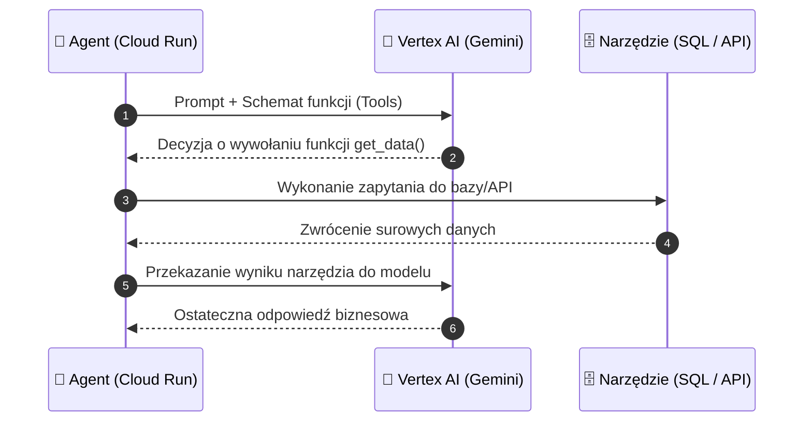
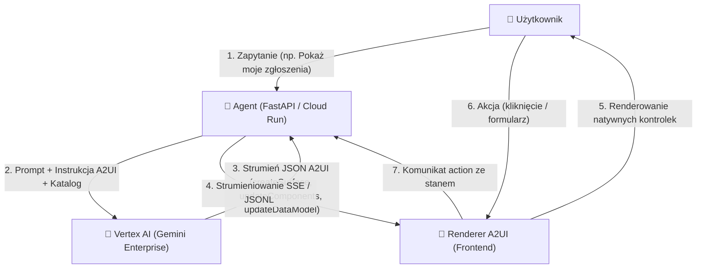

# Moduł 3: Gemini Enterprise & Vertex AI

Podstawą inteligencji autonomicznego agenta jest model językowy (LLM). W zastosowaniach produkcyjnych i korporacyjnych bezpośrednie korzystanie z konsumenckich API niesie ze sobą ryzyko związane z prywatnością danych, limitami przepustowości oraz brakiem gwarancji SLA.

W chmurze Google Cloud Platform modelem dedykowanym do zastosowań biznesowych jest **Gemini w ramach platformy Vertex AI (Gemini Enterprise)**.

---

## Google AI Studio vs. Vertex AI Gemini Enterprise

Dla początkującego inżyniera kluczowe jest zrozumienie różnicy między środowiskiem deweloperskim a korporacyjnym:

| Cecha | Google AI Studio (Konsumenckie API) | Vertex AI Gemini (Enterprise) |
| :--- | :--- | :--- |
| **Prywatność danych** | Dane mogą podlegać analizie (chyba że wybrano płatny tier) | **Brak wykorzystywania promptów do trenowania modeli bazowych** |
| **Rezydentność danych** | Brak gwarancji lokalizacji przetwarzania | Wybór regionu (np. `europe-west1` - Belgia, `europe-west4` - Holandia, `europe-central2` - Warszawa) |
| **Zarządzanie kluczami (KMS)** | Brak obsługi CMEK | Pełna obsługa kluczy zarządzanych przez klienta (CMEK) |
| **Autoryzacja** | Statyczny klucz API (`GEMINI_API_KEY`) | **Google Cloud IAM & Service Accounts (OIDC / OAuth2)** |
| **Gwarancje SLA** | Brak gwarancji SLA | Oficjalne SLA Google Cloud (99.9%+) |
| **Przepustowość (Throughput)** | Dzielone pule zapytań (RPM/TPM) | Możliwość rezerwacji dedykowanej przepustowości (Provisioned Throughput) |

---

## Kluczowe możliwości Gemini w Vertex AI dla Agentów

### 1. Bezpieczeństwo i Filtry Bezpieczeństwa (Safety Settings)
W środowisku produkcyjnym agent nie może generować treści naruszających zasady organizacji. Vertex AI pozwala na precyzyjne ustawienie progów blokowania dla czterech kategorii:
* Mowa nienawiści (*Hate Speech* - `HARM_CATEGORY_HATE_SPEECH`)
* Treści niebezpieczne (*Dangerous Content* - `HARM_CATEGORY_DANGEROUS_CONTENT`)
* Nękanie (*Harassment* - `HARM_CATEGORY_HARASSMENT`)
* Treści o charakterze seksualnym (*Sexually Explicit* - `HARM_CATEGORY_SEXUALLY_EXPLICIT`)

### 2. Uziemienie Danych (Grounding & RAG)
Zmniejszenie zjawiska halucynacji osiąga się poprzez powiązanie modelu z wiarygodnymi źródłami wiedzy:
* **Grounding with Google Search:** Model weryfikuje fakty z aktualnymi informacjami z publicznego internetu.
* **Vertex AI Search (Enterprise Data Stores):** Model automatycznie przeszukuje firmowe repozytoria dokumentów (pliki PDF na Google Cloud Storage, tabele w BigQuery czy bazy danych).

### 3. Wywoływanie Narzędzi (Function Calling / Tool Use)
Model Gemini potrafi przetłumaczyć intencję użytkownika na wywołanie funkcji z ustrukturyzowanymi parametrami JSON. To fundament działania każdego agenta wykonawczego.



---

## Implementacja w Pythonie z Vertex AI SDK

Poniższy kod demonstruje bezpieczne wywołanie modelu `gemini-1.5-flash` w regionie europejskim z wykorzystaniem tożsamości IAM (bez żadnych kluczy w kodzie!):

```python
import vertexai
from vertexai.generative_models import (
    GenerativeModel,
    GenerationConfig,
    HarmCategory,
    HarmBlockThreshold,
)

# 1. Inicjalizacja Vertex AI (wykorzystuje automatyczną tożsamość Service Account)
PROJECT_ID = "twoj-projekt-gcp"
LOCATION = "europe-west1"  # Belgia

vertexai.init(project=PROJECT_ID, location=LOCATION)

# 2. Definicja parametrów generacji i bezpieczeństwa
config = GenerationConfig(
    temperature=0.2,       # Niska temperatura dla bardziej deterministycznych odpowiedzi
    max_output_tokens=2048,
    top_p=0.95
)

safety_settings = {
    HarmCategory.HARM_CATEGORY_DANGEROUS_CONTENT: HarmBlockThreshold.BLOCK_LOW_AND_ABOVE,
    HarmCategory.HARM_CATEGORY_HATE_SPEECH: HarmBlockThreshold.BLOCK_LOW_AND_ABOVE,
    HarmCategory.HARM_CATEGORY_HARASSMENT: HarmBlockThreshold.BLOCK_MEDIUM_AND_ABOVE,
}

# 3. Inicjalizacja modelu
model = GenerativeModel(
    model_name="gemini-1.5-flash",
    generation_config=config,
    safety_settings=safety_settings,
    system_instruction="Jesteś precyzyjnym asystentem analitycznym. Zawsze formatujesz dane jako JSON."
)

# 4. Wywołanie modelu
def analyze_user_prompt(prompt_text: str):
    response = model.generate_content(prompt_text)
    return response.text

if __name__ == "__main__":
    prompt = "Przeanalizuj status zamówienia #4582 i podaj sugerowaną odpowiedź dla klienta."
    result = analyze_user_prompt(prompt)
    print("Odpowiedź Gemini Enterprise:")
    print(result)
```

---

## Dołączanie Narzędzi (Function Calling)

Aby model mógł wywoływać funkcje agenta, definiujemy ich schemat za pomocą obiektów `Tool` lub zwykłych funkcji w Pythonie:

```python
from vertexai.generative_models import FunctionDeclaration, Tool

# Deklaracja schematu funkcji
get_exchange_rate_func = FunctionDeclaration(
    name="get_exchange_rate",
    description="Pobiera aktualny kurs wymiany waluty z bazy NBP.",
    parameters={
        "type": "object",
        "properties": {
            "currency_code": {
                "type": "string",
                "description": "3-literowy kod waluty (np. USD, EUR, GBP)"
            }
        },
        "required": ["currency_code"]
    }
)

tools = Tool(function_declarations=[get_exchange_rate_func])

model_with_tools = GenerativeModel(
    model_name="gemini-1.5-flash",
    tools=[tools]
)

response = model_with_tools.generate_content("Ile kosztuje dzisiaj 100 EUR w PLN?")

# Sprawdzenie czy model zażądał wywołania funkcji
if response.function_calls:
    tool_call = response.function_calls[0]
    print(f"Model wybrał narzędzie: {tool_call.name}")
    print(f"Parametry: {dict(tool_call.args)}")
```

---

## Współpraca Gemini Enterprise z Protokołem A2UI

W architekturze korporacyjnej model Gemini na Vertex AI generuje nie tylko odpowiedzi tekstowe czy wywołania funkcji (Function Calling), ale również **deklaratywne komunikaty protokołu A2UI**.

Dzięki temu agent może dynamicznie budować i aktualizować interfejs graficzny użytkownika (UI) bez ryzyka generowania niebezpiecznego kodu JavaScript czy naruszania spójności wizualnej aplikacji.



### Dlaczego Gemini Enterprise + A2UI?
1. **Bezpieczeństwo (Zero XSS):** Model nie generuje kodu HTML/JS, lecz deklaratywne struktury JSON odwołujące się do predefiniowanego katalogu komponentów.
2. **Prywatność i zgodność korporacyjna:** Zapytania i stan widoków przetwarzane przez Vertex AI nie są wykorzystywane do trenowania modeli publicznych.
3. **Podejście Prompt-First:** W specyfikacji A2UI v0.9.1 / v1.0 schemat i reguły katalogu są przekazywane w instrukcji systemowej (`system_instruction`), co daje modelowi swobodę w kompozycji złożonych drzew widoków.
4. **Context Caching w Vertex AI:** Statyczny opis katalogu komponentów oraz przykłady widoków (Few-Shot) można zapisać w pamięci podręcznej kontekstu (Context Cache) w Vertex AI, co drastycznie obniża koszty tokenów wejściowych i skraca czas pierwszej odpowiedzi (TTFT - *Time To First Token*).

---

## Jak Tworzyć Wizualne Komponenty w Gemini Enterprise

Aby model Gemini poprawnie generował komponenty wizualne, proces projektowania interfejsu dzieli się na trzy główne etapy:

### 1. Definicja reguł A2UI w System Instruction

Instrukcja systemowa (`system_instruction`) przekazywana do modelu musi jasno określać format generowanych komunikatów:
* **Sekwencja komunikatów:** Każda odpowiedź interfejsowa musi składać się z trzech kroków: `createSurface`, `updateComponents` oraz `updateDataModel`.
* **Płaska lista komponentów (Adjacency List):** Komponenty nie są zagnieżdżane w głębokim JSON-ie. Każdy komponent ma unikalne `id`, a relacje rodzic-dziecko definiuje się przez pola `child` (pojedyncze dziecko) lub `children` (lista identyfikatorów dzieci). Komponent startowy musi mieć `id: "root"`.
* **Wiązanie danych (Data Binding):** Pola tekstowe, etykiety i wartości formularzy odwołują się do ścieżek w modelu danych za pomocą formatu JSON Pointer (np. `{"path": "/inbox/unreadCount"}`).

### 2. Wybór podejścia: Basic Catalog vs Custom Catalog

W zależności od potrzeb projektu interfejs definiuje się na dwa sposoby:

#### Sposób A: Kompozycja z klocków podstawowych (Basic Catalog)
Model tworzy widok z uniwersalnych komponentów (`Card`, `Column`, `Row`, `Text`, `TextField`, `Button`, `Divider`, `Icon`, `Image`).

Dla widoków listowych (np. skrzynka odbiorcza, lista transakcji, lista zadań) stosuje się **szablon listy (ChildList template)**:
```json
{
  "id": "items-list",
  "component": "Column",
  "children": {
    "path": "/tickets",
    "componentId": "ticket-row-template"
  }
}
```
W tym schemacie model definiuje pojedynczy wiersz `ticket-row-template` tylko raz, a w `updateDataModel` przesyła tablicę obiektów z danymi zgłoszeń.

#### Sposób B: Dedykowany komponent domenowy (Custom Catalog)
Gdy aplikacja posiada własny Design System (np. firmową kartę zgłoszenia `SupportTicketCard` lub panel `InboxPanel`), do promptu wprowadza się definicję tego komponentu:
```json
{
  "id": "root",
  "component": "SupportTicketCard",
  "ticketId": "TCK-1092",
  "priority": "HIGH",
  "customerName": { "path": "/customer/name" },
  "onResolve": {
    "action": {
      "name": "resolve_ticket",
      "context": { "id": "TCK-1092" }
    }
  }
}
```
Model używa gotowej nazwy komponentu, co skraca generowany kod JSON i zapewnia stuprocentową zgodność ze stylami firmy.

### 3. Obsługa interakcji i akcji użytkownika (User Actions)

Każdy komponent interaktywny (np. `Button`, `TextField`) może zdefiniować wyzwalacz akcji:
* Przycisk zawiera pole `action` z nazwą zdarzenia (`event.name`) oraz opcjonalnym kontekstem (`context`).
* Gdy użytkownik klika przycisk lub zatwierdza formularz, klient wysyła komunikat `action` do agenta.
* Agent przesyła stan akcji do Gemini Enterprise, a model decyduje, czy odesłać zaktualizowany model danych (`updateDataModel`), czy zmodyfikować strukturę widoku (`updateComponents`).

---

## Pełny Przykład: Agent A2UI z Gemini Enterprise i FastAPI

Poniższy kod przedstawia kompletną implementację agenta w Pythonie, który wykorzystuje Vertex AI SDK i model `gemini-1.5-flash` do generowania interfejsu skrzynki zadań (Inbox / Task Panel) w formacie A2UI:

```python
import json
from typing import AsyncGenerator
from fastapi import FastAPI, HTTPException
from fastapi.responses import StreamingResponse
from pydantic import BaseModel
import vertexai
from vertexai.generative_models import GenerativeModel, GenerationConfig

# 1. Inicjalizacja Vertex AI w środowisku GCP
PROJECT_ID = "twoj-projekt-gcp"
LOCATION = "europe-west1"

vertexai.init(project=PROJECT_ID, location=LOCATION)

app = FastAPI(title="A2UI Gemini Enterprise Agent")

# 2. Definicja instrukcji systemowej z zasadami protokołu A2UI
A2UI_SYSTEM_INSTRUCTION = """
Jesteś korporacyjnym asystentem obsługi zadań. Twoim zadaniem jest odpowiadanie użytkownikowi za pomocą deklaratywnego interfejsu A2UI (wersja v0.9.1).

Gdy użytkownik poprosi o panel zadań, skrzynkę odbiorczą (inbox) lub formularz:
1. Wygeneruj komunikat `createSurface` o unikalnym `surfaceId` i katalogu Basic Catalog:
   "https://a2ui.org/specification/v0_9_1/catalogs/basic/catalog.json".
2. Wygeneruj komunikat `updateComponents` zawierający spłaszczoną listę komponentów (Adjacency List).
   - Korzeń widoku musi mieć id="root".
   - Stosuj kontenery: `Card`, `Column`, `Row`.
   - Stosuj elementy: `Text`, `Button`, `Icon`, `Divider`.
   - Dla list stosuj szablon: "children": {"path": "/items", "componentId": "item-template"}.
3. Wygeneruj komunikat `updateDataModel` z właściwymi danymi.

Zwracaj wyłącznie poprawne obiekty JSON, oddzielone nową linią (format JSONL). Nie używaj bloków markdown ```json.
"""

# 3. Inicjalizacja modelu z instrukcją A2UI
model = GenerativeModel(
    model_name="gemini-1.5-flash",
    generation_config=GenerationConfig(
        temperature=0.1,
        max_output_tokens=4096,
        top_p=0.95
    ),
    system_instruction=A2UI_SYSTEM_INSTRUCTION
)

class UserPromptRequest(BaseModel):
    prompt: str
    surface_id: str = "inbox-surface"

class UserActionRequest(BaseModel):
    action: str
    surface_id: str
    context: dict

# 4. Generator strumieniowy JSONL dla klienta A2UI
async def stream_a2ui_response(user_query: str) -> AsyncGenerator[str, None]:
    prompt = f"Użytkownik prosi o: {user_query}. Wygeneruj pełny zestaw komunikatów A2UI."
    
    # Wywołanie strumieniowe w Vertex AI
    response_stream = model.generate_content(prompt, stream=True)
    
    for chunk in response_stream:
        if chunk.text:
            yield chunk.text

@app.post("/api/a2ui/render")
async def render_ui(request: UserPromptRequest):
    """Endpoint strumieniujący komunikaty A2UI do frontendu."""
    return StreamingResponse(
        stream_a2ui_response(request.prompt),
        media_type="application/x-ndjson"
    )

@app.post("/api/a2ui/action")
async def handle_ui_action(request: UserActionRequest):
    """Obsługa akcji użytkownika klikniętej w interfejsie A2UI."""
    if request.action == "complete_task":
        task_id = request.context.get("taskId")
        # Aktualizacja stanu danych w odpowiedzi na akcję
        update_msg = {
            "version": "v0.9.1",
            "updateDataModel": {
                "surfaceId": request.surface_id,
                "path": f"/tasks/{task_id}/status",
                "value": "DONE"
            }
        }
        return update_msg
    
    raise HTTPException(status_code=400, detail="Nieobsługiwana akcja")

if __name__ == "__main__":
    import uvicorn
    uvicorn.run(app, host="0.0.0.0", port=8080)
```

---

## Dobre Praktyki Produkcyjne

1. **Stosuj niską temperaturę (`temperature: 0.0 - 0.2`):** Deterministyczne parametry generacji minimalizują błędy składniowe w strukturze JSON komponentów.
2. **Wykorzystuj Context Caching:** Zapisuj w pamięci podręcznej Vertex AI schemat katalogu oraz przykłady widoków. Redukuje to koszty i skraca czas reakcji interfejsu.
3. **Waliduj komunikaty po stronie serwera:** Zanim przekażesz wygenerowane komunikaty do klienta, przepuść je przez lekki walidator JSON Schema, aby upewnić się, że każde ID w `children` wskazuje na istniejący komponent.
4. **Rozdzielaj dane od widoku:** Jeśli zmienia się jedynie zawartość tekstu lub status pozycji, odsyłaj `updateDataModel`, a nie całe drzewo `updateComponents`.

---

## Podsumowanie

Połączenie Gemini Enterprise w Vertex AI z protokołem A2UI umożliwia:
* Budowanie bezpiecznych, interaktywnych paneli i formularzy bezpośrednio z modeli językowych.
* Wykorzystanie tożsamości **Service Account** i prywatnej infrastruktury Google Cloud bez ryzyka wycieku danych.
* Zachowanie czystego rozdziału między decyzjami modelu a natywnym renderowaniem w design systemie aplikacji.

W kolejnym module przyjrzymy się, jak zarządzać cyklem życia i pamięcią agenta. Przejdź do [Modułu 4: Agent Runtime & Pętla Decyzyjna](04-agent-runtime.md).

