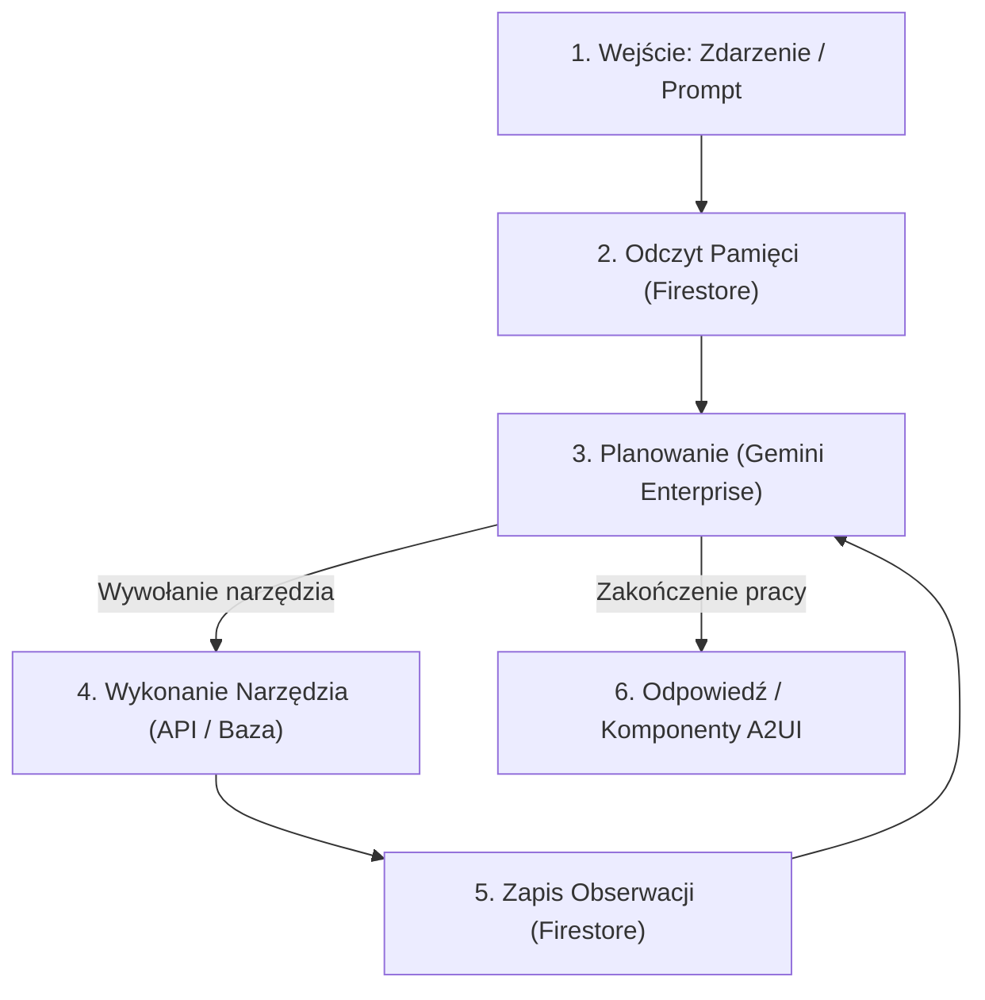

# Moduł 4: Agent Runtime & Pętla Decyzyjna

Sam model językowy (LLM) jest funkcją bezstanową – przyjmuje ciąg tokenów wejściowych i generuje ciąg tokenów wyjściowych. Aby model stał się **autonomicznym agentem**, potrzebuje środowiska wykonawczego (**Agent Runtime**), które zarządza stanem, pamięcią, kolejkowaniem zadań i wywoływaniem narzędzi.

W tym module dowiesz się, jak zbudowane jest środowisko uruchomieniowe agenta, jak przebiega pętla decyzyjna (ReAct) oraz jak zapewnić stabilność i odporność na błędy w systemach produkcyjnych.

---

## Czym jest Agent Runtime?

**Agent Runtime** to warstwa oprogramowania (harness), która otacza model językowy i zarządza jego cyklem życia:



Przykłady środowisk uruchomieniowych:
* **Google Agent Development Kit (ADK):** Oficjalny framework do budowy i orkiestracji agentów wspierający protokoły A2A i A2UI.
* **Vertex AI Agent Engine:** Zarządzana usługa w chmurze GCP do uruchamiania i hostowania agentów w architekturze bezserwerowej.
* **Własny kontener Python (FastAPI + Pydantic + Asyncio):** Lekki, w pełni kontrolowany runtime wdrażany na Cloud Run.

---

## Anatomia Pętli Decyzyjnej Agenta (ReAct Pattern)

Najpopularniejszym wzorcem działania agenta jest pętla **Reasoning + Acting (ReAct)**:

1. **Percepcja (Perceive):** Agent odbiera bodziec zewnętrzny (wiadomość użytkownika, komunikat z kolejki Pub/Sub lub kliknięcie w interfejsie A2UI).
2. **Przywrócenie stanu (State Recovery):** Runtime pobiera z bazy danych (np. Firestore) historię poprzednich interakcji dla danego `conversation_id`.
3. **Planowanie (Plan):** Model analizuje stan i decyduje, czy posiada już wszystkie informacje do odpowiedzi, czy musi wykonać akcję.
4. **Wykonanie narzędzia (Act):** Runtime wykonuje kod wybranego narzędzia (zapytanie SQL, wywołanie API REST, wysłanie wiadomości A2A do innego agenta).
5. **Obserwacja (Observe):** Wynik działania narzędzia jest dołączany do kontekstu konwersacji.
6. **Refleksja (Reflect):** Model weryfikuje, czy wynik narzędzia rozwiązał problem. Jeśli nie, pętla powtarza się.
7. **Odpowiedź (Emit):** Gdy cel zostanie osiągnięty, agent generuje odpowiedź tekstową lub pakiet komponentów A2UI.

---

## Zarządzanie Pamięcią i Stanem

Agent w środowisku chmurowym nie może przechowywać stanu w pamięci RAM procesu, ponieważ instancje kontenerów mogą być w każdej chwili zatrzymywane i skalowane do zera (**Scale-to-Zero**).

Rozróżniamy dwa rodzaje pamięci:

### 1. Pamięć Krótkoterminowa (Short-Term / Session Memory)
Przechowuje historię bieżącej konwersacji (ostatnie wiadomości, bufor zmiennych).
* **Technologia w GCP:** Google Cloud Firestore lub Memorystore (Redis).
* **Struktura rekordu:**
  ```json
  {
    "conversation_id": "conv_9988-aabb",
    "user_id": "user_123",
    "history": [
      {"role": "user", "content": "Ile wynosi limit kredytowy dla klienta ABC?"},
      {"role": "assistant", "content": null, "tool_call": "fetch_client_limit"},
      {"role": "tool", "content": "{\"limit\": 50000, \"currency\": \"PLN\"}"},
      {"role": "assistant", "content": "Limit kredytowy dla klienta ABC wynosi 50 000 PLN."}
    ],
    "last_updated": "2026-08-31T22:05:00Z"
  }
  ```

### 2. Pamięć Długoterminowa (Long-Term / Semantic Memory)
Pozwala agentowi przypominać sobie wiedzę sprzed wielu dni lub miesięcy za pomocą wyszukiwania wektorowego (Embeddings).
* **Technologia w GCP:** Vertex AI Vector Search lub Cloud SQL z rozszerzeniem `pgvector`.

---

## Zabezpieczenia i Odporność na Błędy w Runtime

W środowisku produkcyjnym junior developer musi pamiętać o zabezpieczeniu pętli agenta przed typowymi awariami:

### 1. Limit Maksymalnych Iteracji (`max_iterations`)
Zabezpiecza przed nieskończonymi pętlami (*Infinite Tool Loops*), w których model w kółko wywołuje to samo błędne narzędzie:
```python
MAX_ITERATIONS = 5

for iteration in range(MAX_ITERATIONS):
    response = model.generate_content(...)
    if not response.tool_calls:
        # Agent zakończył pracę i zwrócił odpowiedź
        return response.text
    # Wykonaj narzędzie...
else:
    raise TimeoutError("Agent przekroczył maksymalną liczbę iteracji planowania.")
```

### 2. Punkty Kontrolne z Udziałem Człowieka (Human-in-the-Loop - HITL)
Operacje o wysokim ryzyku (np. usunięcie bazy danych, autoryzacja przelewu powyżej określonej kwoty, wysłanie oficjalnego pisma) **nie mogą** być wykonywane przez agenta automatycznie.
* W takim przypadku Agent Runtime zatrzymuje pętlę i emituje komponent A2UI z przyciskiem akceptacji: *"Czy potwierdzasz wykonanie operacji X?"*.
* Dopiero po odebraniu `userAction` z podpisem użytkownika operacja jest realizowana.

### 3. Graceful Timeout & Fallback
Jeśli zewnętrzne narzędzie lub model nie odpowie w ciągu określonego czasu (np. 15 sekund), runtime powinien zwrócić użytkownikowi czytelny komunikat błędu zamiast zrywać połączenie bez słowa wyjaśnienia.

---

## Podsumowanie

* **LLM to mózg**, ale **Agent Runtime to ciało** – odpowiada za komunikację ze światem zewnętrznym, bazami danych i użytkownikami.
* Stan agenta **zawsze** zapisuj w zewnętrznej bazie danych (Firestore / Redis), aby umożliwić bezserwerowe skalowanie.
* Zawsze stosuj `max_iterations`, limity czasu (timeouts) oraz punkty **Human-in-the-Loop** dla ryzykownych akcji.

W kolejnym module dowiesz się, jak spakować i wdrożyć taki runtime na chmurze Google. Przejdź do [Modułu 5: Wdrażanie na Cloud Run](05-cloud-run.md).
