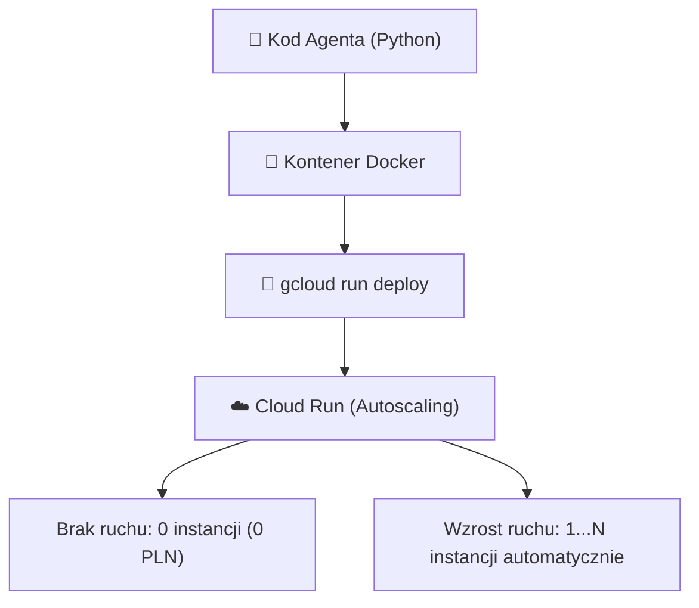

# Moduł 5: Wdrażanie na Cloud Run

Gdy napiszesz kod swojego agenta w Pythonie, musisz uruchomić go na niezawodnej, skalowalnej infrastrukturze. W Google Cloud Platform domyślnym i zalecanym wyborem dla mikroserwisów agentowych jest **Google Cloud Run**.

W tym module dowiesz się, jak działa Cloud Run, dlaczego idealnie pasuje do systemów agentowych, jak spakować aplikację do kontenera Docker i wdrożyć ją za pomocą jednej komendy.

---

## Czym jest Google Cloud Run?

**Cloud Run** to w pełni zarządzana platforma bezserwerowa (Serverless), która uruchamia kontenery bez konieczności zarządzania klastrami maszyn wirtualnych (jak w Kubernetes/GKE) czy systemem operacyjnym.



---

## Dlaczego Cloud Run jest idealny dla Agentów AI?

### 1. Skalowanie od Zera (Scale to Zero)
Jeśli Twój agent jest używany tylko w godzinach pracy biura lub sporadycznie, w nocy liczba instancji spada do zera. **Płacisz wyłącznie za czas, w którym kontener faktycznie przetwarza zapytania.**

### 2. Obsługa Długich Zapytań (Długi Timeout)
Modele językowe wykonujące wieloetapowe pętle planowania mogą potrzebować kilkunastu sekund lub minut na odpowiedź. Tradycyjne funkcje serverless (jak podstawowe Cloud Functions) mają często niskie limity. Cloud Run pozwala na ustawienie limitu czasu zapytania aż do **60 minut** (`--timeout=3600`).

### 3. Natywna obsługa Strumieniowania (SSE i WebSockets)
Dla protokołu A2UI kluczowe jest płynne przesyłanie tokenów i komponentów w czasie rzeczywistym. Cloud Run wspiera protokół HTTP/2 oraz Server-Sent Events (SSE) bez żadnej dodatkowej konfiguracji.

### 4. Przydział CPU (CPU Allocation)
Domyślnie Cloud Run przydziela procesor tylko w trakcie obsługi aktywnego żądania HTTP. W przypadku agentów wykonujących asynchroniczne zadania w tle możesz włączyć tryb stałego CPU (`--no-cpu-throttling`).

---

## Praktyczny przewodnik: Od kodu do wdrożenia

### Krok 1: Przygotowanie `Dockerfile`

Dobry kontener dla agenta powinien być lekki, bezpieczny i uruchamiany jako użytkownik nieposiadający uprawnień roota:

```dockerfile
# Wybór oficjalnego, lekkiego obrazu Pythona
FROM python:3.12-slim

# Blokowanie buforowania wyjścia konsoli dla natychmiastowych logów w Cloud Logging
ENV PYTHONUNBUFFERED=1 \
    PYTHONDONTWRITEBYTECODE=1 \
    PORT=8080

WORKDIR /app

# Kopiowanie zależności
COPY requirements.txt .
RUN pip install --no-cache-dir -r requirements.txt

# Kopiowanie kodu źródłowego
COPY . .

# Bezpieczeństwo: uruchomienie jako użytkownik nieuprzywilejowany
RUN useradd -m appuser && chown -R appuser /app
USER appuser

# Cloud Run przekazuje zmienną PORT (domyślnie 8080)
EXPOSE 8080

CMD ["uvicorn", "main:app", "--host", "0.0.0.0", "--port", "8080", "--workers", "1"]
```

---

### Krok 2: Kod Aplikacji (`main.py`)

```python
from fastapi import FastAPI
from fastapi.responses import StreamingResponse
import asyncio
import os

app = FastAPI(title="A2UI Agent Service")

@app.get("/healthz")
def health():
    return {"status": "ok", "service": "agent-orchestrator"}

@app.post("/api/v1/chat")
async def chat_endpoint(payload: dict):
    # Logika wywołania agenta...
    return {"response": "Zadanie przyjęte do realizacji"}
```

---

### Krok 3: Wdrożenie za pomocą `gcloud CLI`

Przejdź do katalogu z projektem i wykonaj poniższą komendę w terminalu:

```bash
# Ustawienie aktywnego projektu GCP
gcloud config set project TWOJ_PROJEKT_ID

# Wdrożenie na Cloud Run
gcloud run deploy a2ui-agent-service \
  --source . \
  --region europe-west1 \
  --platform managed \
  --service-account agent-runner-sa@TWOJ_PROJEKT_ID.iam.gserviceaccount.com \
  --memory 1Gi \
  --cpu 1 \
  --concurrency 40 \
  --timeout 300 \
  --set-env-vars "PROJECT_ID=TWOJ_PROJEKT_ID,ENVIRONMENT=production" \
  --no-allow-unauthenticated
```

### Co oznaczają te flagi?
* `--source .`: Cloud Build automatycznie zbuduje obraz kontenera z Twojego katalogu (nie musisz nawet mieć lokalnie zainstalowanego Dockera!).
* `--region europe-west1`: Wybór regionu (Belgia – blisko Polski, niskie opóźnienia).
* `--service-account`: Przypisanie dedykowanej tożsamości maszynowej (omówionej szczegółowo w Module 7).
* `--concurrency 40`: Pojedyncza instancja kontenera może przetwarzać do 40 zapytań jednocześnie (dla asynchronicznego FastAPI to optymalna wartość).
* `--no-allow-unauthenticated`: Serwis jest prywatny – dostęp mają tylko uwierzytelnieni użytkownicy i inne agenty.

---

## Monitorowanie i Logi

Wszystkie strumienie `stdout` i `stderr` generowane przez Twojego agenta trafiają automatycznie do usługi **Google Cloud Logging**.

Możesz podglądać logi w czasie rzeczywistym z poziomu terminala:

```bash
gcloud run services logs tail a2ui-agent-service --region europe-west1
```

---

## Podsumowanie

* Cloud Run zapewnia pełną izolację kontenerową bez narzutu administracyjnego.
* Konfiguracja parametrów `--memory`, `--timeout` i `--concurrency` pozwala zoptymalizować koszty oraz wydajność działania agentów.
* Kontener powinien zawsze nasłuchiwać na porcie zdefiniowanym w zmiennej środowiskowej `$PORT` (domyślnie `8080`).

W kolejnym module przechodzimy do absolutnego fundamentu bezpieczeństwa w GCP. Przejdź do [Modułu 6: IAM w Google Cloud](06-iam-fundamentals.md).
