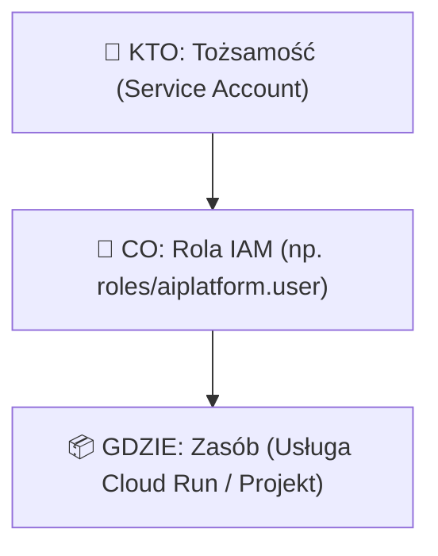
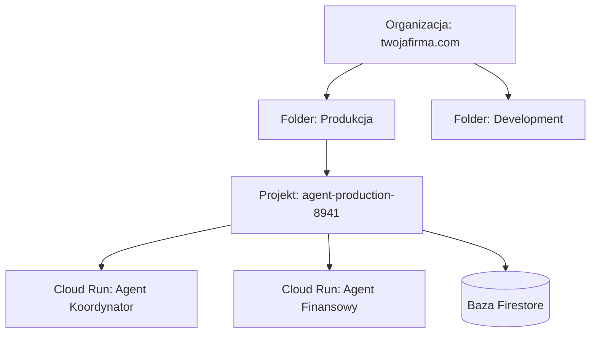
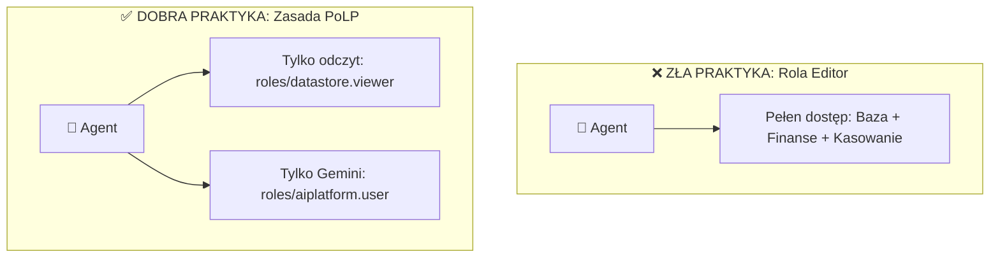

# Moduł 6: IAM w Google Cloud (Identity & Access Management)

Każde zapytanie w chmurze Google – czy to wywołanie modelu Gemini, odczyt z bazy danych, czy wykonanie innego agenta – musi zostać uwierzytelnione i zautoryzowane. Odpowiada za to system **Cloud IAM (Identity and Access Management)**.

Jeśli jesteś początkującym inżynierem, zrozumienie IAM jest najważniejszym krokiem do budowania bezpiecznych aplikacji produkcyjnych.

---

## Złota Formuła IAM

W Google Cloud całe bezpieczeństwo sprowadza się do prostego równania:

$$\text{KTO (Tożsamość)} + \text{CO MOŻE ZROBIĆ (Rola)} + \text{NA JAKIM ZASOBIE (Zasób)}$$



### 1. KTO (Principal / Member)
To podmiot żądający dostępu:
* Konto użytkownika Google (`user:jan@firma.pl`),
* Grupa w Google Workspace (`group:devs@firma.pl`),
* **Konto usługowe aplikacji / agenta (`serviceAccount:agent-sa@projekt.iam.gserviceaccount.com`)**.

### 2. CO (Role & Permissions)
Uprawnienie to pojedyncza atomowa operacja (np. `run.routes.invoke` lub `aiplatform.endpoints.predict`). 
W GCP **nie przypisuje się uprawnień pojedynczo**. Zamiast tego uprawnienia są pogrupowane w **Role**.

### 3. GDZIE (Zasób i Hierarchia)
Poziom, na którym rola zostaje nadana.

---

## Hierarchia Zasobów w GCP i Dziedziczenie

Zasoby w GCP są zorganizowane w drzewiastą strukturę:



### Reguła Dziedziczenia Uprawnień:
Uprawnienia nadane wyżej w hierarchii **zawsze spływają w dół** do wszystkich zasobów podrzędnych. Jeśli nadasz agentowi uprawnienie na poziomie całego Projektu, uzyska on dostęp do wszystkich instancji baz i serwisów w tym projekcie. Dlatego uprawnienia należy nadawać **jak najniżej w drzewie** (np. bezpośrednio na konkretnym serwisie Cloud Run).

---

## Typy Ról w GCP

Dla początkujących kluczowe jest rozróżnienie trzech typów ról:

### 1. Role Podstawowe (Basic / Primitive Roles) – ⚠️ UNIKAJ NA PRODUKCJI!
Są to historyczne, bardzo szerokie role:
* `roles/owner` (Właściciel – pełna kontrola, w tym zarządzanie płatnościami i usuwanie projektu),
* `roles/editor` (Edytor – modyfikacja niemal wszystkich zasobów w projekcie),
* `roles/viewer` (Przeglądający – odczyt wszystkich danych).

> **Dlaczego to pułapka juniora?** 
> Często w trakcie lokalnego debugowania pojawia się błąd `403 Permission Denied`. Kuszącym "szybkim rozwiązaniem" jest nadanie roli `Editor` dla konta agenta. Na produkcji jest to **poważny błąd bezpieczeństwa** – skompromitowany agent mógłby skasować bazę danych lub utworzyć drogie maszyny wirtualne do kopania kryptowalut.

### 2. Role Predefiniowane (Predefined Roles) – ✅ ZALECANY STANDARD
Drobnoziarniste role zarządzane i aktualizowane przez Google dla poszczególnych usług. 

Przykłady dla systemów agentowych:
* `roles/run.invoker` – pozwala wyłącznie wywołać dany serwis Cloud Run (brak praw do edycji kodu czy usuwania).
* `roles/aiplatform.user` – pozwala wysyłać zapytania do modeli Vertex AI / Gemini.
* `roles/secretmanager.secretAccessor` – pozwala jedynie odczytać wartość hasła/sekretu.
* `roles/datastore.user` – pozwala na odczyt i zapis w bazie Cloud Firestore.

### 3. Role Niestandardowe (Custom Roles)
Jeśli żadna predefiniowana rola nie spełnia Twoich wymagań, możesz stworzyć własną rolę zawierającą ściśle wyselekcjonowaną listę atomowych uprawnień.

---

## Zasada Najmniejszych Uprawnień (Principle of Least Privilege - PoLP)

Każdy komponent systemu agentowego powinien posiadać **wyłącznie te uprawnienia, które są absolutnie niezbędne** do wykonania jego zadań, i ani jednego więcej.



---

## Warunki IAM (IAM Conditions)

GCP pozwala dodawać warunki do przypisań ról za pomocą języka **CEL (Common Expression Language)**. Dzięki temu możesz ograniczyć ważność uprawnień:
* **Czasowo:** dostęp ważny tylko do końca tygodnia.
* **Wg zasobu:** dostęp do Secret Managera tylko dla sekretów z prefiksem `agent-config-*`.

### Przykład nadania roli z poziomu CLI:

```bash
# Nadanie uprawnienia do wywoływania Gemini dla konta agenta
gcloud projects add-iam-policy-binding TWOJ_PROJEKT_ID \
  --member="serviceAccount:orch-sa@TWOJ_PROJEKT_ID.iam.gserviceaccount.com" \
  --role="roles/aiplatform.user"
```

---

## Podsumowanie

1. **Złota zasada bezpieczeństwa:** Nigdy nie używaj roli `Editor` ani `Owner` dla kont maszynowych w aplikacjach produkcyjnych.
2. **Predefiniowane role:** Zawsze wybieraj dedykowaną rolę (np. `roles/run.invoker`, `roles/aiplatform.user`).
3. **Izolacja:** Ograniczaj zakres roli do pojedynczego zasobu zamiast całego projektu, gdy tylko jest to możliwe.

W kolejnym module nauczysz się zarządzać tożsamościami maszynowymi agentów. Przejdź do [Modułu 7: Service Accounts w Praktyce](07-service-accounts.md).
