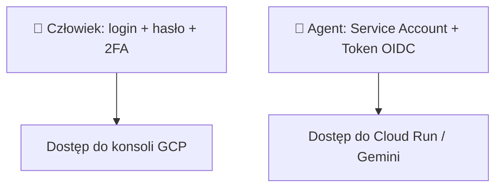
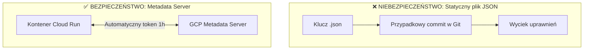

# Moduł 7: Service Accounts (Konta Usługowe) w GCP

Podczas gdy ludzie logują się do chmury za pomocą przeglądarki, hasła i uwierzytelniania dwuskładnikowego (2FA), aplikacje, kontenery i agenci AI potrzebują tożsamości maszynowej. W Google Cloud tożsamość ta nosi nazwę **Konta Usługowego (Service Account)**.

W tym module dowiesz się, jak tworzyć konta usługowe, dlaczego pobieranie kluczy JSON to zły nawyk oraz jak bezpiecznie uwierzytelniać aplikacje na Cloud Run.

---

## Czym jest Service Account?

**Service Account (SA)** to specjalne konto reprezentujące aplikację lub usługę w chmurze, a nie konkretnego człowieka.

Adres e-mail konta usługowego ma format:
```text
nazwa-konta@twoj-projekt-gcp.iam.gserviceaccount.com
```



---

## Rodzaje Kont Usługowych w GCP

### 1. Konta zarządzane przez użytkownika (User-Managed SA) – ✅ STANDARD PRODUKCYJNY
Konta tworzone ręcznie lub przez kod infrastruktury (np. Terraform) dla konkretnego mikroserwisu.
* Przykłady: `orchestrator-agent-sa`, `payment-agent-sa`.
* Posiadają wyłącznie ściśle określone role predefiniowane.

### 2. Domyślne konta usługowe (Default Service Accounts) – ⚠️ ANTYWZORZEC
Tworzone automatycznie po włączeniu niektórych API (np. Compute Engine Default SA: `123456789-compute@developer.gserviceaccount.com`).
* **Dlaczego ich unikać?** Domyślnie historycznie posiadały one rolę `Editor` na całym projekcie. Nigdy nie przypisuj domyślnego konta do swoich kontenerów produkcyjnych.

### 3. Agenci usługowi Google (Google-Managed Service Agents)
Konta tworzone wewnętrznie przez Google w formacie `service-NUMER_PROJEKTU@gcp-sa-....iam.gserviceaccount.com`, aby poszczególne usługi chmurowe (np. Cloud Build, Artifact Registry) mogły komunikować się ze sobą.

---

## Pułapka Kluczy JSON vs. Dołączone Konta Usługowe

Jednym z najczęstszych błędów początkujących inżynierów jest generowanie i pobieranie pliku klucza prywatnego w formacie JSON (`service-account-key.json`).



### Dlaczego statyczne klucze JSON są niebezpieczne?
1. **Ryzyko wycieku:** Pliki kluczy łatwo przypadkowo dodać do repozytorium Git (*credential leak*).
2. **Brak rotacji:** Klucz prywatny jest ważny bezterminowo (do momentu ręcznego usunięcia).
3. **Brak potrzeby:** Wewnątrz środowiska GCP kontener nie potrzebuje żadnego pliku z kluczem!

### Jak działa Metadata Server w Cloud Run?
Gdy wdrażasz kontener na Cloud Run z flagą `--service-account`, platforma Google automatycznie udostępnia wewnątrz kontenera lokalny serwer metadanych (`http://metadata.google.internal/computeMetadata/v1/`).

Oficjalne biblioteki Pythona (`google-auth`, `google-cloud-storage`, `vertexai`) **automatycznie i transparentnie** pobierają z niego krótkotrwałe tokeny dostępowe (ważne zazwyczaj 1 godzinę) i same je odświeżają. Nie musisz pisać ani jednej linijki kodu obsługi tokenów!

---

## Praktyka: Tworzenie i przypisywanie konta usługowego

### Krok 1: Utworzenie dedykowanego konta usługowego dla Agenta

```bash
gcloud iam service-accounts create agent-orchestrator-sa \
  --display-name="Service Account dla Agenta Koordynatora"
```

### Krok 2: Nadanie minimalnych wymaganych ról

```bash
PROJECT_ID="twoj-projekt-gcp"
SA_EMAIL="agent-orchestrator-sa@${PROJECT_ID}.iam.gserviceaccount.com"

# Uprawnienie do odpytywania Gemini na Vertex AI
gcloud projects add-iam-policy-binding ${PROJECT_ID} \
  --member="serviceAccount:${SA_EMAIL}" \
  --role="roles/aiplatform.user"

# Uprawnienie do zapisu stanu sesji w Firestore
gcloud projects add-iam-policy-binding ${PROJECT_ID} \
  --member="serviceAccount:${SA_EMAIL}" \
  --role="roles/datastore.user"
```

### Krok 3: Dołączenie konta do usługi Cloud Run

```bash
gcloud run deploy orchestrator-agent \
  --source . \
  --region europe-west1 \
  --service-account "${SA_EMAIL}"
```

---

## Lokalne testowanie bez kluczy JSON (Impersonation)

Jak testować kod na lokalnym komputerze bez pobierania pliku klucza JSON? Użyj mechanizmu **Podszywania się (Service Account Impersonation)**!

1. Nadaj swojemu kontu użytkownika uprawnienie do podszywania się pod Service Account:
```bash
gcloud iam service-accounts add-iam-policy-binding ${SA_EMAIL} \
  --member="user:twoj-email@firma.pl" \
  --role="roles/iam.serviceAccountTokenCreator"
```

2. Zaloguj się lokalnie z flagą podszywania:
```bash
gcloud auth application-default login --impersonate-service-account="${SA_EMAIL}"
```

Teraz każda biblioteka Pythona uruchomiona na Twoim komputerze będzie lokalnie działała z dokładną tożsamością i uprawnieniami konta usługowego, bez generowania jakichkolwiek plików kluczy prywatnych!

---

## Podsumowanie

* Każdy agent i mikroserwis powinien mieć **własne, dedykowane konto usługowe**.
* **Nigdy nie pobieraj kluczy JSON**, jeśli Twój kod działa wewnątrz Google Cloud (Cloud Run, GKE, Compute Engine).
* Do lokalnego developmentu używaj `gcloud auth application-default login --impersonate-service-account`.

W ostatnim module połączymy całą wiedzę i skonfigurujemy bezpieczną komunikację A2A z RBAC. Przejdź do [Modułu 8: Bezpieczeństwo i RBAC dla A2A](08-a2a-security-rbac.md).
