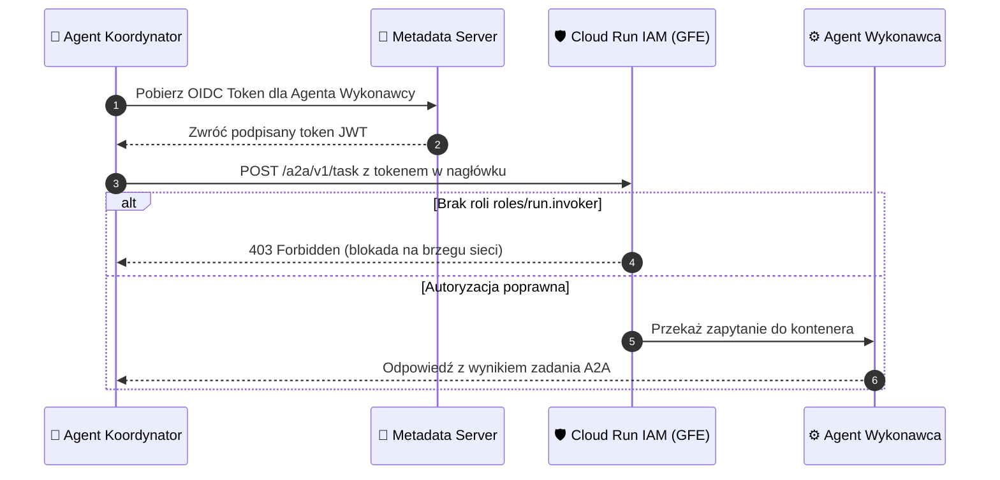

# Moduł 8: Bezpieczeństwo, Identyfikacja i RBAC dla Agentów A2A

Gdy w systemie działa wiele wyspecjalizowanych agentów na oddzielnych instancjach Cloud Run, komunikacja między nimi (**A2A**) musi być zabezpieczona na poziomie kryptograficznym. 

Niedopuszczalna jest sytuacja, w której agent wykonawczy (np. wykonujący operacje na bazie finansowej) przyjmuje niezautoryzowane zapytania z otwartego internetu lub od dowolnego nieznanego serwisu.

W tym module dowiesz się, jak skonfigurować bezpieczną komunikację **Service-to-Service** za pomocą tokenów **OIDC JWT**, jak działa rola `roles/run.invoker` oraz jak wdrożyć granularny **RBAC (Role-Based Access Control)** dla narzędzi agentowych.

---

## Architektura Bezpieczeństwa A2A na Cloud Run

Zabezpieczenie komunikacji między Agentem A (Koordynatorem) a Agentem B (Wykonawcą) opiera się na dwóch warstwach:
1. **Warstwa Infrastruktury (Cloud Run IAM):** Google Front End weryfikuje podpis kryptograficzny tokena tożsamości OIDC przed przekazaniem zapytania do kontenera.
2. **Warstwa Aplikacji (RBAC w kodzie agenta):** Agent B sprawdza tożsamość nadawcy i decyduje, do których narzędzi nadawca ma dostęp.



---

## OIDC ID Token vs. OAuth2 Access Token

Dla junior developera to jedno z najważniejszych rozróżnień w chmurze Google:

| Typ Tokena | Przeznaczenie | Format | Gdzie jest używany? |
| :--- | :--- | :--- | :--- |
| **OAuth2 Access Token** | Dostęp do API Google (Vertex AI, Cloud Storage, BigQuery) | Nieprzejrzysty ciąg znaków (`ya29...`) | Wywołania usług zarządzanych przez Google |
| **OIDC ID Token** | Potwierdzenie tożsamości w komunikacji Service-to-Service | Podpisany kryptograficznie **JWT** | Wywołania prywatnych usług **Cloud Run** |

Token OIDC zawiera wewnątrz pole `aud` (**Audience**), które musi dokładnie odpowiadać docelowemu adresowi URL wywoływanej usługi Cloud Run.

---

## Krok po kroku: Konfiguracja Bezpiecznego A2A

### Krok 1: Wdrożenie Agenta Wykonawcy jako prywatnego serwisu

```bash
# Agent Wykonawca nie zezwala na publiczny dostęp (--no-allow-unauthenticated)
gcloud run deploy database-agent \
  --source ./db_agent \
  --region europe-west1 \
  --no-allow-unauthenticated \
  --service-account db-agent-sa@TWOJ_PROJEKT.iam.gserviceaccount.com
```

Po wdrożeniu otrzymasz docelowy adres URL, np.: `https://database-agent-xyz-uc.a.run.app`.

---

### Krok 2: Nadanie uprawnienia `roles/run.invoker` dla Agenta Koordynatora

Uprawnienie nadajemy **bezpośrednio na usłudze Agenta B**, a nie na całym projekcie:

```bash
gcloud run services add-iam-policy-binding database-agent \
  --region europe-west1 \
  --member="serviceAccount:orch-agent-sa@TWOJ_PROJEKT.iam.gserviceaccount.com" \
  --role="roles/run.invoker"
```

Teraz wyłącznie konto `orch-agent-sa` posiada prawo wywołania usługi `database-agent`. Każde inne zapytanie zostanie natychmiast zablokowane kodem HTTP 403 przez platformę Google.

---

### Krok 3: Generowanie Tokena OIDC w kodzie Agenta Koordynatora (Python)

Biblioteka `google-auth` udostępnia moduł `id_token` do automatycznego pobierania i buforowania tokenów OIDC:

```python
import httpx
from google.oauth2 import id_token
from google.auth.transport.requests import Request

# Docelowy URL Agenta Wykonawcy (Audience)
TARGET_AUDIENCE = "https://database-agent-xyz-uc.a.run.app"

def get_oidc_id_token(audience: str) -> str:
    """Automatycznie pobiera token OIDC z Metadata Servera GCP."""
    auth_req = Request()
    token = id_token.fetch_id_token(auth_req, audience)
    return token

async def send_secure_a2a_message(payload: dict):
    # Pobranie tokena tożsamości
    token = get_oidc_id_token(TARGET_AUDIENCE)
    
    headers = {
        "Authorization": f"Bearer {token}",
        "Content-Type": "application/json"
    }
    
    async with httpx.AsyncClient(timeout=30.0) as client:
        response = await client.post(
            f"{TARGET_AUDIENCE}/a2a/v1/task",
            headers=headers,
            json=payload
        )
        response.raise_for_status()
        return response.json()
```

---

## Granularny RBAC na poziomie Narzędzi Agenta

Gdy Agent B udostępnia wiele akcji (np. `read_metrics`, `export_database`, `drop_tables`), samo uprawnienie `roles/run.invoker` może być zbyt ogólne. 

W kodzie Agenta B możemy odczytać tożsamość nadawcy z nagłówka autoryzacyjnego i zastosować macierz uprawnień (**Role-Based Access Control**):

```python
from fastapi import FastAPI, Header, HTTPException, Depends
from google.oauth2 import id_token
from google.auth.transport.requests import Request

app = FastAPI(title="Secure DB Agent with Tool-level RBAC")

# URL tego serwisu Cloud Run — musi odpowiadać audience w tokenie OIDC
EXPECTED_AUDIENCE = "https://database-agent-xyz-uc.a.run.app"

# Macierz uprawnień narzędzi wg Service Accountów
TOOL_PERMISSIONS = {
    "read_metrics": [
        "orch-agent-sa@twoj-projekt.iam.gserviceaccount.com",
        "monitoring-sa@twoj-projekt.iam.gserviceaccount.com"
    ],
    "export_database": [
        "admin-orchestrator-sa@twoj-projekt.iam.gserviceaccount.com"
    ]
}

def verify_caller_identity(authorization: str = Header(...)) -> str:
    """Weryfikuje podpis JWT i zwraca adres email wywołującego Service Accounta."""
    if not authorization.startswith("Bearer "):
        raise HTTPException(status_code=401, detail="Nieprawidłowy nagłówek autoryzacyjny")
    
    raw_token = authorization.split(" ")[1]
    try:
        # Weryfikacja tokena z kluczami publicznymi Google
        # WAŻNE: Zawsze waliduj audience, aby zapobiec atakom token replay!
        claims = id_token.verify_oauth2_token(raw_token, Request(), audience=EXPECTED_AUDIENCE)
        caller_email = claims.get("email")
        return caller_email
    except Exception as e:
        raise HTTPException(status_code=401, detail=f"Błąd weryfikacji tokena OIDC: {str(e)}")

@app.post("/a2a/v1/task")
async def execute_task(task_data: dict, caller_email: str = Depends(verify_caller_identity)):
    action = task_data.get("action")
    allowed_callers = TOOL_PERMISSIONS.get(action, [])
    
    if caller_email not in allowed_callers:
        raise HTTPException(
            status_code=403,
            detail=f"Konto {caller_email} nie posiada uprawnień do wykonania akcji {action}"
        )
        
    return {"status": "SUCCESS", "message": f"Akcja {action} wykonana pomyślnie"}
```

---

## Dodatkowe Zabezpieczenia Sieciowe (Network Security)

Dla środowisk o rygorystycznych wymogach bezpieczeństwa (np. bankowość, medycyna):
1. **Ograniczenie Ingressu w Cloud Run:** Ustawienie `--ingress=internal` sprawia, że usługa jest dostępna wyłącznie z wewnątrz sieci VPC projektu (brak dostępu z publicznego internetu).
2. **Direct VPC Egress:** Pozwala kontenerom Cloud Run łączyć się z prywatnymi instancjami Cloud SQL lub bazami danych bez publicznych adresów IP.
3. **VPC Service Controls (VPC-SC):** Tworzy kryptograficzny obwód bezpieczeństwa wokół zasobów Google Cloud (Vertex AI, Cloud Storage), uniemożliwiając eksfiltrację danych poza organizację.

---

## Podsumowanie Kursu

Gratulacje! Przeszedłeś przez kompletny program budowy i zabezpieczania systemów agentowych na GCP:

1. **A2A** – ustrukturyzowana komunikacja JSON między autonomicznymi agentami.
2. **A2UI** – bezpieczny, strumieniowy interfejs użytkownika z dwukierunkowym wiązaniem stanu.
3. **Gemini Enterprise** – modele językowe w Vertex AI z gwarancjami prywatności i SLA.
4. **Agent Runtime** – bezstanowa pętla decyzyjna ReAct z persystencją w Firestore.
5. **Cloud Run** – bezserwerowa platforma kontenerowa z automatycznym skalowaniem.
6. **IAM** – zarządzanie tożsamościami i zasadą najmniejszych uprawnień.
7. **Service Accounts** – bezpieczne tożsamości maszynowe z Metadata Serverem zamiast kluczy JSON.
8. **RBAC i OIDC** – kryptograficzne uwierzytelnianie service-to-service dla agentów.

Powrót do [Spisu Treści Kursu](index.md).
