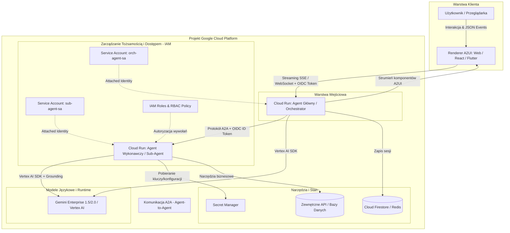

# Kurs GCP & Agenci AI: Architektura, Komunikacja i Bezpieczeństwo

Witaj w praktycznym przewodniku po budowie, wdrażaniu i zabezpieczaniu systemów agentowych (Agentic AI) na platformie **Google Cloud Platform (GCP)**. 

Kurs został zaprojektowany z myślą o inżynierach i programistach (w tym junior developerach), którzy chcą zrozumieć, jak działają nowoczesne autonomiczne agenty, jak komunikują się między sobą (**A2A**), jak renderują interaktywne interfejsy użytkownika (**A2UI**), jak wykorzystują modele **Gemini Enterprise w Vertex AI**, oraz jak bezpiecznie wdrażać je na **Cloud Run** z wykorzystaniem **IAM, Service Accounts i RBAC**.

---

## Architektura referencyjna systemu agentowego na GCP

Poniższy diagram przedstawia pełny przepływ w produkcyjnym środowisku agentowym:

---

## Program kursu

Kurs składa się z 8 modułów merytorycznych, ułożonych w logiczną ścieżkę od protokołów komunikacyjnych, przez infrastrukturę AI i konteneryzację, aż po bezpieczeństwo i kontrolę uprawnień.

| Moduł | Temat | Zakres wiedzy |
| :--- | :--- | :--- |
| **00** | [**Przewodnik Startowy dla Juniora**](00-gcp-basics-for-juniors.md) | Podstawy GCP, regiony, Project ID, włączanie API, analogia biurowca dla IAM i pierwsze kroki z `gcloud`. |
| **01** | [**Protokół A2A (Agent-to-Agent)**](01-a2a-protocol.md) | Standard komunikacji między agentami, wzorce Orchestrator-Worker i Peer-to-Peer, struktura komunikatów JSON, rejestracja i odkrywanie agentów (Agent Discovery). |
| **02** | [**Interfejs A2UI (Agent-to-User)**](02-a2ui-protocol.md) | Deklaratywny strumień interfejsu użytkownika, dwukierunkowe wiązanie danych (`two-way data binding`), katalogi komponentów i obsługa akcji użytkownika. |
| **03** | [**Gemini Enterprise & Vertex AI**](03-gemini-enterprise.md) | Wykorzystanie modeli Gemini w środowisku korporacyjnym, prywatność danych, mechanizmy Grounding (RAG), wywoływanie narzędzi (Function Calling) i parametry bezpieczeństwa. |
| **04** | [**Agent Runtime & Pętla Decyzyjna**](04-agent-runtime.md) | Środowisko wykonawcze agenta, cykl życia (Perceive-Plan-Act-Reflect), zarządzanie stanem i pamięcią sesji, odporność na błędy (timeouts, retries, Human-in-the-Loop). |
| **05** | [**Cloud Run dla Agentów**](05-cloud-run.md) | Wdrażanie agentów w kontenerach bezserwerowych, skalowanie od zera (scale to zero), zarządzanie współbieżnością, obsługa strumieniowania (SSE) i długich zapytań. |
| **06** | [**IAM w Google Cloud (Wprowadzenie)**](06-iam-fundamentals.md) | Fundamenty zarządzania tożsamością i uprawnieniami w GCP: Zasada Kto + Co + Gdzie, hierarchia zasobów, role podstawowe vs predefiniowane vs niestandardowe, reguła najmniejszych uprawnień. |
| **07** | [**Service Accounts w GCP**](07-service-accounts.md) | Tożsamość maszynowa, rodzaje kont usługowych, bezpieczne używanie dołączonych tożsamości (Attached SA) i Metadata Server zamiast statycznych kluczy JSON, podszywanie się pod konta (Impersonation). |
| **08** | [**Bezpieczeństwo i RBAC dla A2A**](08-a2a-security-rbac.md) | Uwierzytelnianie service-to-service za pomocą tokenów OIDC JWT, weryfikacja tożsamości w Cloud Run (`roles/run.invoker`), granularna kontrola dostępu (RBAC) do narzędzi agenta i izolacja sieciowa. |

---

## Wymagania wstępne

Aby w pełni skorzystać z kursu, przydatna będzie:
* Podstawowa znajomość języka **Python** (pisanie prostych aplikacji backendowych, np. FastAPI / Flask).
* Zrozumienie formatu **JSON** oraz komunikacji przez protokół **HTTP/REST**.
* Ogólne pojęcie o **konteneryzacji (Docker)**.
* Zainstalowane narzędzie wiersza poleceń [`gcloud CLI`](https://cloud.google.com/sdk/docs/install) (lub dostęp do Google Cloud Shell w przeglądarce).

Przejdź do [Modułu 1: Protokół A2A (Agent-to-Agent)](01-a2a-protocol.md), aby rozpocząć naukę od podstaw komunikacji między autonomicznymi agentami.
